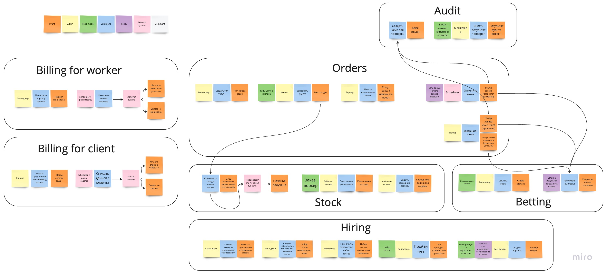

# Make cats free again (MCF)

## Event storming модель

### Контексты event storming модели

Система условно поделена на контексты по процессам.

**Billing** - по опыту, системы оплаты содержат много специфической логики и взаимодействия с провайдерами оплаты. К тому же эта часть команд и событий на схеме получилась совсем не связанной с прочими.

**Hiring** - еще одна полностью независимая часть системы (если смотреть на ES модель), и изолированная в том числе и с точки зрения самого процесса.

**Betting** - из требований видно, что процесс создания ставок побочный, и к основной функциональности относится опосредованно.

**Stock** - выделение этой части в контекст (помимо отдельной сущности в реальном мире) повлиял тот факт, что актор "Работник склада" уникальный и единственный для этого набора стикеров.

**Orders** - самая "мякотка" системы, здесь содержатся все команды по работе с заказом и смене его статусов.

**Audit** - по моим ощущениям, это полноценный отдельный контекст, тем более, что "основной" контекст работы с услугой получился большой.

## Модель данных

## Общая модель всех коммуникаций в системе

## Схематичная модель взаимодействия

## Реализация системы

Мы пишем систему с 0, поэтому, с одной стороны, сразу хочется сделать все "по-красоте": внедрить все новомодные и best-practice технологии и концепции, а с другой не хочется сильно вкладываться в проект, который еще не "доказал", что будет прибыльным, или достаточно нагруженным для микросервисов.
Очень просится **Hiring** в отдельный сервис, потому что он сам по себе выглядит отдельной системой подбора персонала, которая в будущем может быть прикручена почти куда угодно.
**Betting** имеет все шансы быть частью, поддерживаемой по остаточному принципу. Я бы не стала начинать работы по написанию, пока все остальное не было бы готовым. Есть соблазн вынести за пределы системы, написать "на коленке" и развернуть на каком-нибудь тестовом стенде.

Итог: на данном этапе пошла бы по стопам Ибрагима - сделала монолит, и следила, чтобы модули (они же контексты из ES схемы) были изолированные, на случай, если придется делить на микросервисы.

## Возможные проблемы

??? пока ничего не приходит в голову. Возможны обычные неприятные эффекты монолита: сломается одно, пусть самое мелкое, - встанет вся система.
