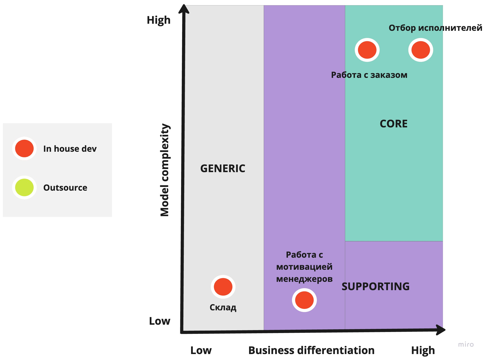
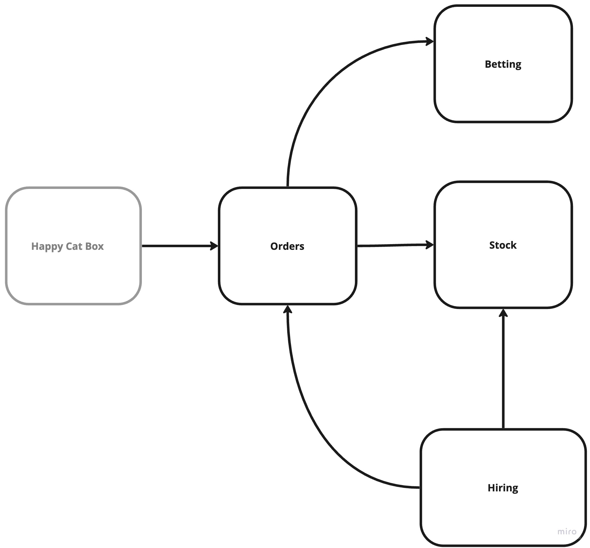
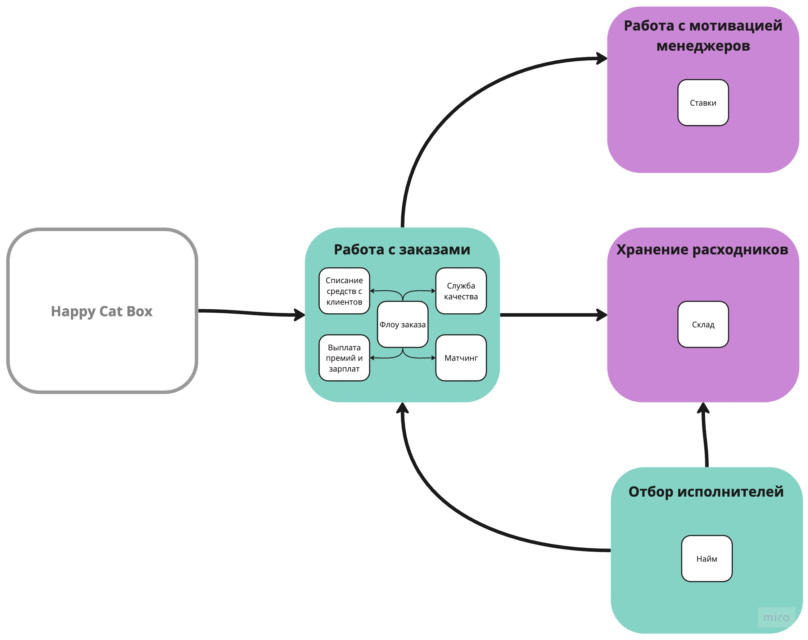
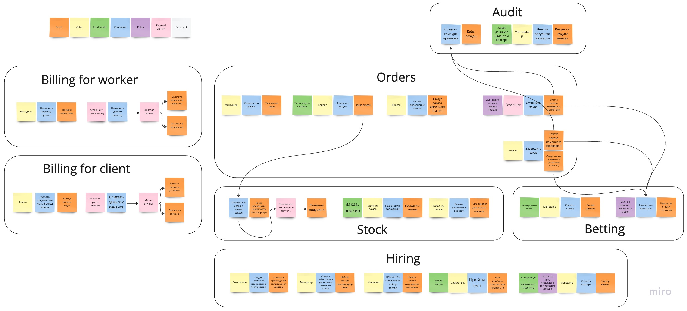
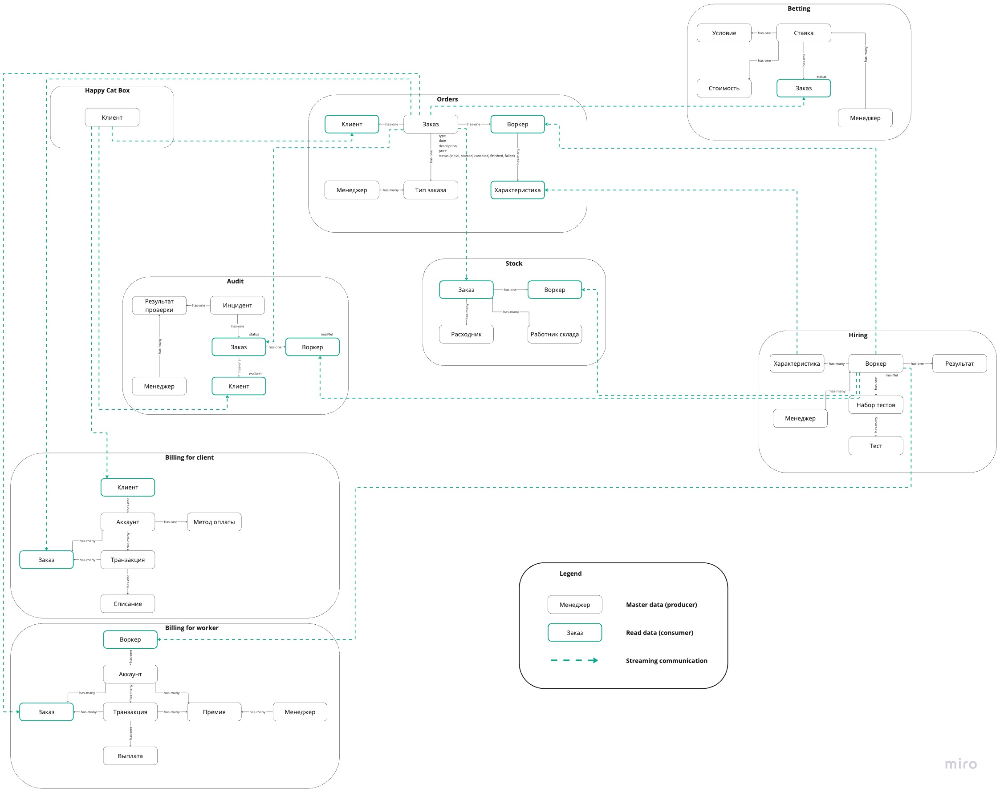
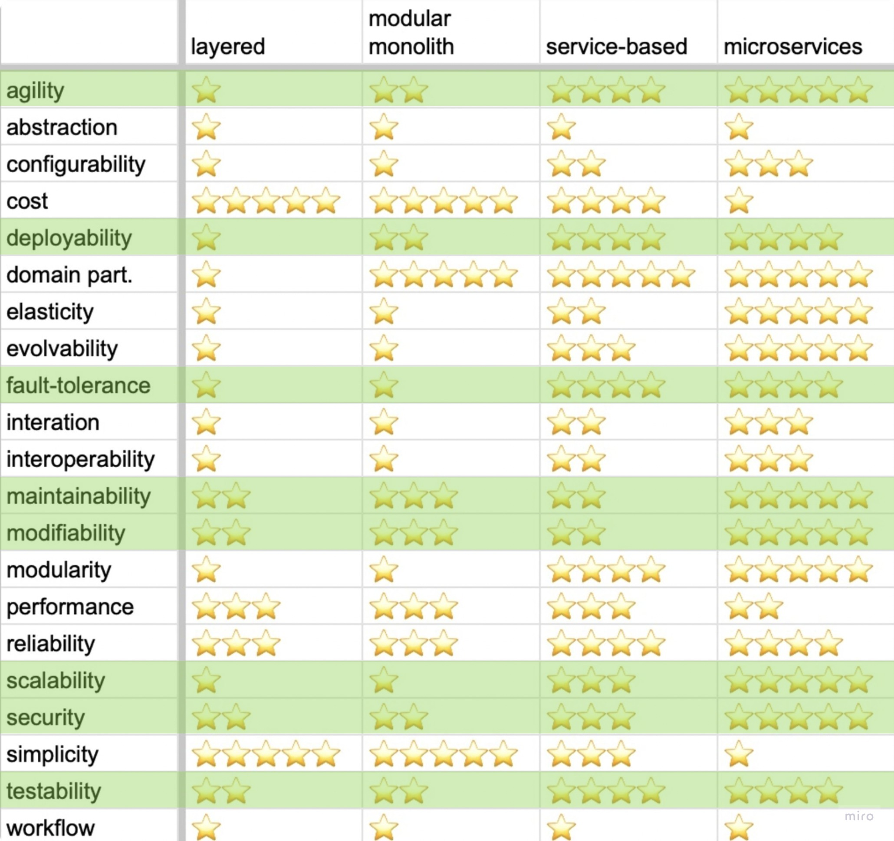

# Make cats free again (MCF)

**Домен: Выполнение рутинных котодел**

## Поддомены

1 Хранение расходников для заказов

2 Работа над мотивацией менеджеров (ставки)

3 Отбор исполнителей

4 Работа с заказом

| Вид поддомена                             | Конкурентное преимущество | Сложность | Изменчивость |
|-------------------------------------------|---------------------------|-----------|--------------|
| Хранение расходников для заказов          |             N             |     N     |       N      |
| Работа над мотивацией менеджеров (ставки) |             N             |     N     |       N      |
| Отбор исполнителей                        |             Y             |     Y     |       Y      |
| Работа с заказом                          |             Y             |     Y     |       Y      |

С определением сложности поддомена Отбор исполнителей были сложности, т.к., с технической точки зрения, ничего сложного в нем нет, но оценка соискателей считается нетривиальной задачей в образовании.

Далее идет игантская картинка общей схемы связей между поддоменами.

## Bounded Contexts

| Поддомен                                  | Предполагаемый вид поддомена | Выделенный боундед-контекст                                                                                                 |
|-------------------------------------------|------------------------------|-----------------------------------------------------------------------------------------------------------------------------|
| Хранение расходников для заказов          |            Generic           |                                                            Склад                                                            |
| Работа над мотивацией менеджеров (ставки) |          Supporting          |                                                            Ставки                                                           |
| Отбор исполнителей                        |             Core             |                                                             Найм                                                            |
| Работа с заказом                          |             Core             | Флоу заказа  Аудит заказов  Выплаты зп, премий, списание штрафов исполнителям  Списание оплаты и начисление скидок клиентам |

Вопреки уроку, в поддомене Работа с заказом получилось очень много bounded контекстов, но пока мне это все видится очень логичным.

 

## Характеристики

**1 Availability/Fault tolerance**
> [US-081] Мы ожидаем 1 к заявок в день от рандомных котов, также, судя по отзывам, наши конкуренты могут попытаться нас заддосить в этом месте...

**2 Security**

Для защиты данных исполнителей, клиентов и платежей.
Простая система ролей (Работник склада, Менеджер, Исполнитель, Клиент). Функциональность не пересекается.

**3 Затраты неважны**
> ... Деньги на данный момент не критичны, happy cat box готовы потратить столько, сколько потребуется...

**4 Проект реализуется с 0**
> ... Для этого она планирует реализовать проект с нуля по заданным требованиям...

**5 Maintainability 6 Modifiability 7 Extensibility**

Из урока
> ...поддерживаемость суперважна, потому что без неё система скатится либо в big ball of mud...

Присутствуют поддомены с большой изменчивостью. К тому же проект только зарождается, без сомнений, он будет еще много раз дописан или даже переписан.

**7 Agility 8 Testability 9 Deployability**

Из урока, как следствие присутствия требования низкого TTM.
> Бизнесу необходим высокий низкий ТТМ (Time To Market), чтобы конкурировать на рынке...

**10 Scalability**

Из урока, как следствие присутствия словосочетания "Конкурентное преимущество".
> Благодаря отсеву и матчингу компания планирует выделяться на фоне конкурентов...

**11 Simplicity, 12 Usability, 13 Accessability**

Для части Работы с заказом, потому что вовлечены клиенты (с остальными работают лояльные сотрудники компании), для них все должно быть понятно и удобно.

## Выбор архитектурного стиля

Воспользуемся схемой, предложенной в уроке 2.2. Выделим в ней зеленым важные для нас характеристики. Из полученного, учитывая, что деньги не имеют значение, выходит, что самый подходящий для нашего случая стиль - микросервисы. 

