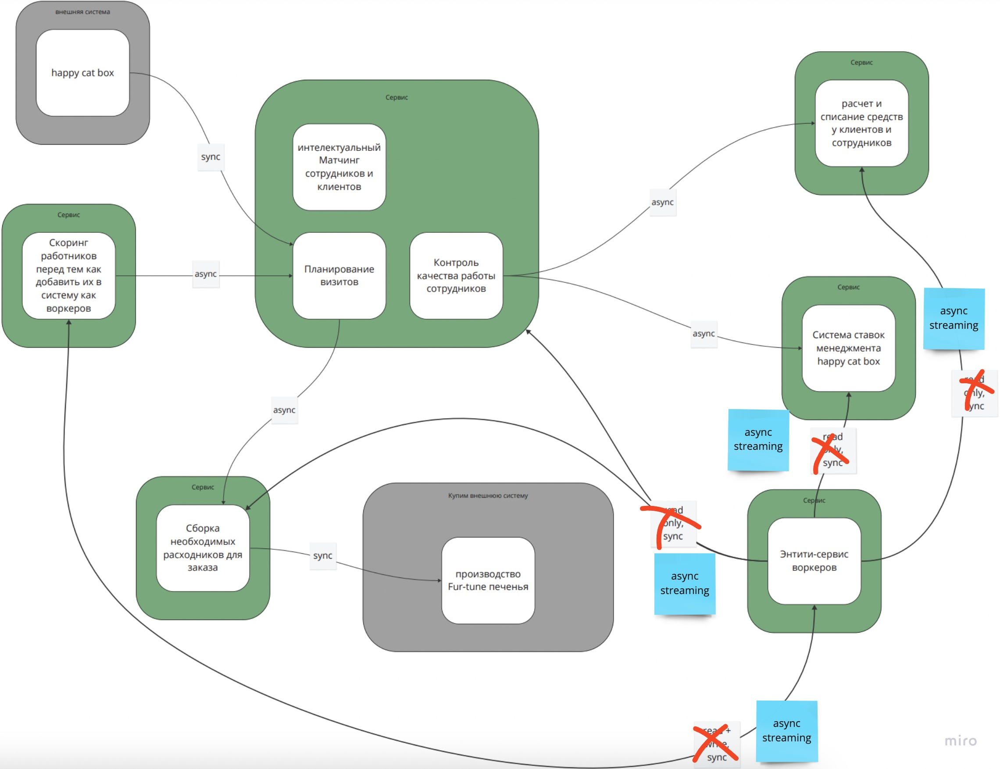
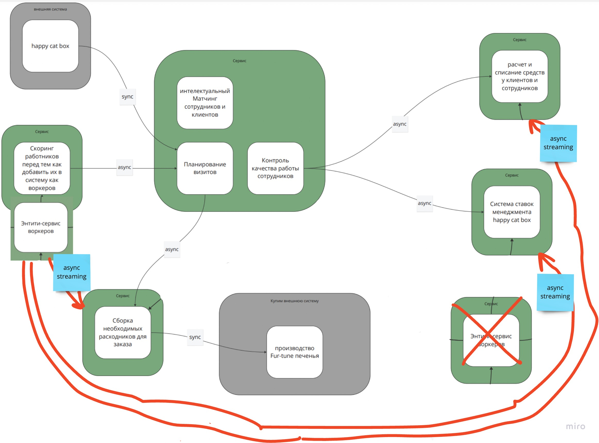
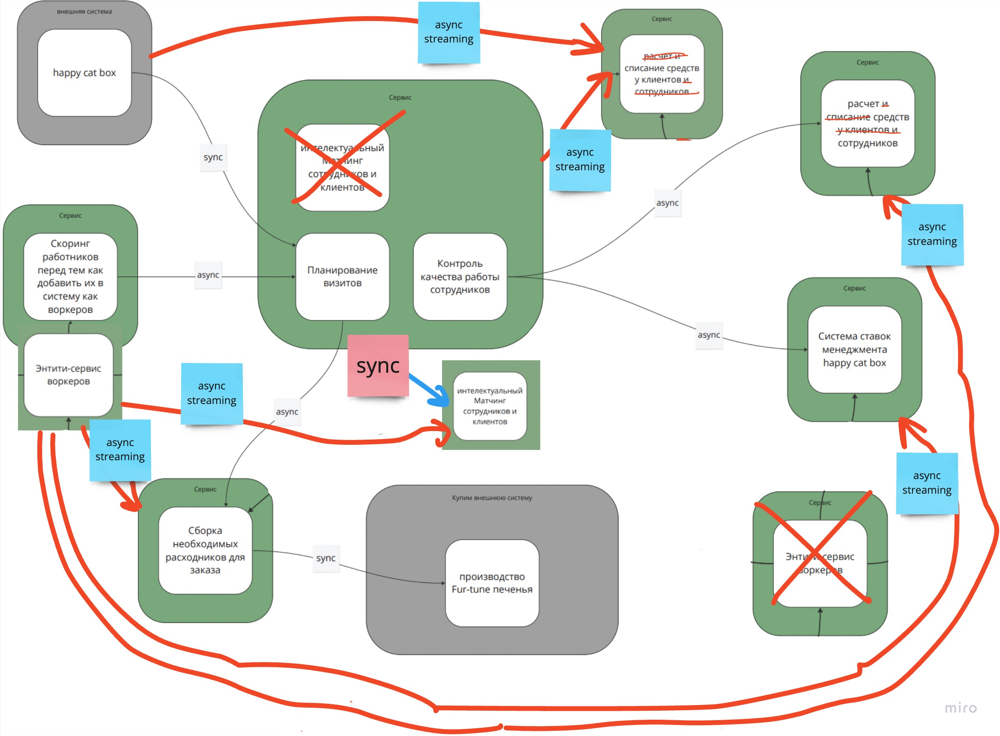

# Make cats free again (MCF)

## Текущая система, нуждающаяся в изменениях

## Посчитать для каждого удалённого сервиса и связанных с ним сервисов значение instability

Под **удалённым** сервисом я понимаю сервис, внешний к системе, поэтому рассмотрим HappyCatBox, Производство fur-tune печенья и связанные с ними сервисы.

- HappyCatBox в рамках системы имеет 1 исходящую связь (Се) и ни одной входящей (Са), *Instability = 1 / (1 + 0) = 1*.
  Значение высокое, но здесь ничего не поделать.
- Производство fur-tune в рамках системы имеет 1 входящую связь (Са) и ни одной исходящей (Се), *Instability = 0 / (0 + 1) = 0*.
- Сервис Заказов, связанный с HappyCatBox, имеет 3 исходящие связи (Ce) и 3 входящие (Са), *Instability = 3 / (3 + 3) = 0.5* (!!!).
  Сервис содержит bounded контекст матчинга из core поддомена, поэтому такое высокое значение вызывает опасения.
- Сервис Склада, связанный с Производством fur-tune, имеет 1 исходящие связи (Ce) и 2 входящие (Са), *Instability = 1 / (1 + 2) = 0.33*.
  Этот сервис в нашей (не Ибрагима) вселенной не содержит bounded контексты, связанные с core поддоменами, поэтому можно считать значение приемлемым.
  
Посчитаем значение instability и для остальных сервисов
  
- Расчет и списание средств имеет 2 входящие связи (Са) и ни одной исходящей (Се)), *Instability = 0 / (0 + 2) = 0*.
- Ставки имеет 2 входящие связи (Са) и ни одной исходящей (Се)), *Instability = 0 / (0 + 2) = 0*.
- Энтити-сервис воркеров имеет 5 исходящих связей (Се) и 1 входящую (Са), *Instability = 5 / (5 + 1) = 0.83* (!!!).
- Скоринг работников 2 исходящие связи (Се) и 1 входящую (Са), *Instability = 2 / (2 + 1) = 0.66* (!!!).
  Сервис содержит bounded контекст скоринга работников из core поддомена, поэтому такое высокое значение вызывает опасения.

## Описать, какие сервисы и боундед-контексты в каком месте и каким образом будут меняться

- Энтити-сервис воркеров опутал своей паутиной почти все остальные сервисы, поэтому сейчас это потенциальная точка отказа всей системы.
Нужно заменить вид коммуникаций на асинхронный, чтобы, в случае если сломается энтити-сервис, система продолжила работать с данными, которые у нее есть.

Еще нужно объединить этот сервис с сервисом, содержащим скоринг воркеров, т.к. это единственное место, где данные создаются.

Если посчитать значение instability после объединение получится следующее.
  - Скоринг работников 4 исходящие связи (Се) и 0 входящих (Са), *Instability = 4 / (4 + 0) = 1* (стало только хуже :'().
  - Сервис Заказов имеет 3 исходящие связи (Ce) и 2 входящие (Са), *Instability = 3 / (3 + 2) = 0.6* (стало только хуже :'().

Как видно, что-то пошло не так, но объединение все равно произойдет 🙈.

- Интеллектуальным матчинг выглядел как кандидат для Pipe архитектуры (и, по некоторым данным, для графовой БД), теперь же он находится в одном сервисе с bounded контекстами, логика
которых не подразумевает имплементацию через Pipe архитектуру (или мы имеем еще одну проблему). Необходимо разделить сервис с заказами на 2: один для планирования и контроля качества, другой для матчинга.

Проверим на всякий случай значение instability.
  - Скоринг работников 5 исходящих связей (Се) и 0 входящих (Са), *Instability = 5 / (5 + 0) = 1* (:'().
  - Сервис Заказов имеет 4 исходящие связи (Ce) и 2 входящие (Са), *Instability = 4 / (2 + 2) = 1* (фантастика :'().

- Еще стоит заметить, что в системе под выплаты и зачисления выделен один bounded контект, предполагаю, что сервис выполнен как layered монолит с одной БД. Это чревато спутыванием логики и, как следствие, появлением ошибок в оплате и/или списании, что почти всегда плохо кончается для компании.
Несмотря на это и, хотя изначально я бы разделила контексты (выплата, зачисление) на 2 микросервиса со стилем layered монолит и реляционными БД, изменения здесь запланировала в последнюю очередь, т.к. контексты все же имеют одинаковые характеристики и требования к хранению данных.

Значения instability не изменились.
  - Скоринг работников 6 исходящих связей (Се) и 0 входящих (Са), *Instability = 6 / (6 + 0) = 1*.
  - Сервис Заказов имеет 4 исходящие связи (Ce) и 2 входящие (Са), *Instability = 4 / (2 + 2) = 1*.

## Cпланировать, как и в какой последовательности будет происходить работа c изменениями

Вне зависимости от того, есть люди и ресурс или нужный опыт, работа запланирована по следующим шагам.

1 Сначала трансформируем тип коммуникаций в сервисе для энтити воркеров. После этого перенесем данные в БД для скоринг, затем всю логику (если такая вообще есть), содержащуюся в энтити сервисе, в сервис скоринга.

2 Выделение Матчинга в отдельный сервис сделаем по подходу Change Data Capture, т.к. он помогает в ситуациях, когда нужно не только вынести код, но и поменять вид базы данных, а это именно наш случай.

3 Разнесение выплат и списания можно сделать по подходу Strangler Fig Application, т.к. по требованиям пересечения в логике минимальны, связность внутри должна быть минимальной. Из сервиса выделяем, скажем, выплаты, помещаем в отдельный сервис, а потом создаем для нового сервиса свою БД и копируем туда нужные данные из прошлого.

