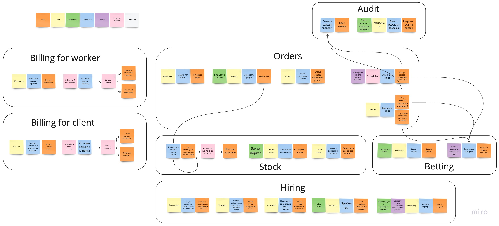
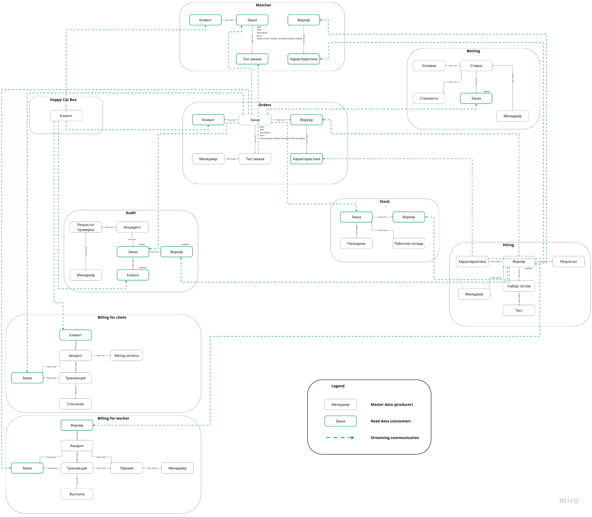
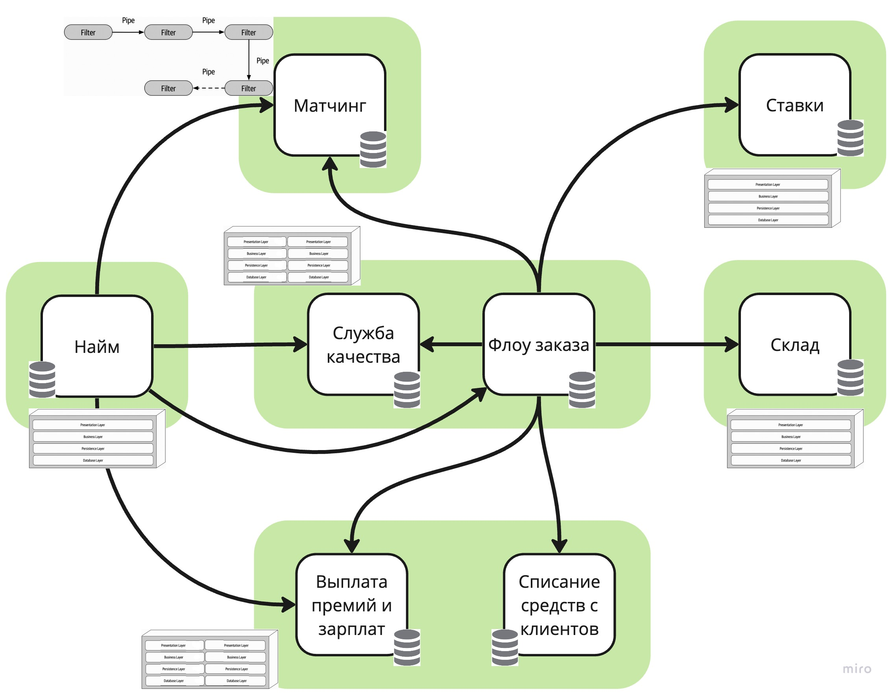

# Make cats free again (MCF)

## Stakeholders

Список получился из условия домашнего задания. Темнее выделены стейкхолдеры, которых не было в списке, но, которые, по моему мнению, должны присутствовать.

## Выбор архитектурного стиля

### Характеристики

**1 Availability/Fault tolerance**
> [US-081] Мы ожидаем 1 к заявок в день от рандомных котов, также, судя по отзывам, наши конкуренты могут попытаться нас заддосить в этом месте...

> (из ДЗ к 3 уроку) ...выяснилось, что котам из Happy Cat Box наш проект понравился, поэтому приходит не 10 заказов в день, а 10 заказов в минуту

**2 Security**

Для защиты данных исполнителей, клиентов и платежей.
Простая система ролей (Работник склада, Менеджер, Исполнитель, Клиент). Функциональность не пересекается.

> CatFinComplience

**3 Затраты неважны**
> ... Деньги на данный момент не критичны, happy cat box готовы потратить столько, сколько потребуется...

**4 Проект реализуется с 0**
> ... Для этого она планирует реализовать проект с нуля по заданным требованиям...

**5 Maintainability**

> (из урока 2) ...поддерживаемость суперважна, потому что без неё система скатится либо в big ball of mud...

Присутствуют поддомены с большой изменчивостью. К тому же проект только зарождается, без сомнений, он будет еще много раз дописан или даже переписан.

> (из ДЗ к 3 уроку) ...система должна работать без сбоев, а если сбой случается, то должно быть понятно, что и где чинить

**6 Agility 7 Testability 8 Deployability**

Из урока 2, как следствие присутствия требования низкого TTM.
> Бизнесу необходим высокий низкий ТТМ (Time To Market), чтобы конкурировать на рынке...

**9 Scalability**

Из урока 2, как следствие присутствия словосочетания "Конкурентное преимущество".
> Благодаря отсеву и матчингу компания планирует выделяться на фоне конкурентов...

**10 Modularity** 

Для Матчера, из требований.
> ...Наша цель — использовать реализованные шаги в нужной нам последовательности, которая иногда может изменяться, при этом необходимо иметь возможность добавлять или редактировать шаги, как нам это необходимо.

**11 Usability, 12 Accessability**

Для части Работы с заказом, потому что вовлечены клиенты (с остальными работают лояльные сотрудники компании), для них все должно быть понятно и удобно.

**13 Релизный цикл для всей системы — месяц, для Найма работников — неделя**

**14 Reliability**

> (из ДЗ к 3 уроку) Фин отдел боится потерять любую финансовую информацию и хочет решение, которое будет гарантировать, что всё будет ок

После разбора ДЗ к 2 уроку пришлось отредактировать поддомены и bounded контексты. На двух картинках ниже то, что у меня получилось по итогу.

### Распределение характеристик по bounded контекстам

У меня, как и у Ибрагима, получились характеристики, относящиеся ко всем контекстам сразу (Maintainability - по запросу разработчиков к быстрым фиксам, Agility, Testability, Deployability - как неотъемлемые характеристики требования низкого TTM), и характеристики, уникальные для конкретных поддоменов (разная длительность релизов по решению топ-менеджмента, Modularity - для сложного алгоритмически Матчера, Scalability - для Core поддоменов, Security - для частей с оплатой и списанием, чтобы попасть под CatFinComplience, Accessability и Usability - для частей, с которыми взаимодействует клиент, Fault tolerance - для нагруженных Заказов и Найма).

### Выбираем стиль

В системе разные требования к разным частям (разные релизные циклы, например), а это показание к использованию **микросервисного стиля**.

Выделила микросервисы для bounded контекстов, как советовали в уроке 3.2, объединяя контексты с пересечением характеристик.

Получились следующие микросервисы
- **Найм**, т.к. для него отдельное требование по релизам, к тому же Топ-менеджмент поделился планами сделать Найм отдельным продуктом и продавать.
- Исходя из предыдущей картинки можно было бы предположить, что **Склад** и **Ставки** стоит объединить, т.к. они простые и имеют одинаковые характеристики, но я не буду этого делать из-за того, что они относятся к разным поддоменам, и из-за того, что, кажется, у менеджмента есть свои планы на Ставки.
- **Матчинг** изначально позиционировался, как изолированная часть со скрытыми алгоритмами, к тому же он имеет уникальную характеристику Modularity, поэтому поместим его в отдельный микросервис.
- **Выплата** и **Списание** просятся быть объединенными по общей логике и из-за одинаковых характеристик, к тому же так будет проще отслеживать, что мы попадаем под CatFinComplience.
- Остались **Флоу заказа** и **Служба качества**. С ними, на удивление, сложно, потому что, несмотря на уникальную характеристику контекста Флоу заказа, не хочется простую логику Службы качества выделять в отдельный сервис, к тому же по смыслу качество заказов неразрывно связано с самими заказами, поэтому эти 2 контекста тоже были объединены.

Проще всего было подобрать стиль для Матчинга, т.к. требования так и кричат, что нужно использовать **Pipeline**. Все остальное не такое однозначное и как будто не требует какого-то специального подхода, поэтому было принято решение все микросервисы, содержащие 1 контекст реализовывать как **layered-монолит**, а содержащие 2 контекста - как **модульный монолит**.

Результат можно посмотреть на схеме ниже.

### Выбираем стиль коммуникаций

Система получилась очень подходящей для асинхронных взаимодействий. 

Если посмотреть на бизнес-события, есть только 4 события, на которые реагируют другие контексты: "Заказ создан" - знак для склада на сбор расходников, 3 варианта 
завершения заказа - знак для Ставок рассчитать выигрыш и знак для Службы качества сохранить заказ как проблемный. Любая из этих реакций может быть совершена с задержкой, Флоу заказа (который и диспатчит эти события) совсем не заинтересован в ожидании ответа об успехе или провале такой реакции.

Вспомним стриминговые события из модели данных, они тоже, очевидно, асинхронные.

Единственная коммуникация, которая должна быть синхронный - расчет исполнителя, потому что без этого, в моем понимании, заказ не может считаться созданным.

### Выбираем БД

Не нашла в требованиях необходимости особенного хранения данных. Разве что данные платежей должны быть надежно сохранены, но для похожей части системы Ибрагим выбрал реляционную БД, посчитав ее достаточно надежной, я поступлю таким же образом. И даже заскейлю это решение на все микросервисы (хотя мне все еще кажется, что Ставки "не достойны" целого микросервиса, их данные можно хранить хоть в excel). Для каждого контекста в микросервисах с 2 контекстами будет своя база данных, на случай, если придется все-таки их разделять.

### Фитнес-функции

## ADR

