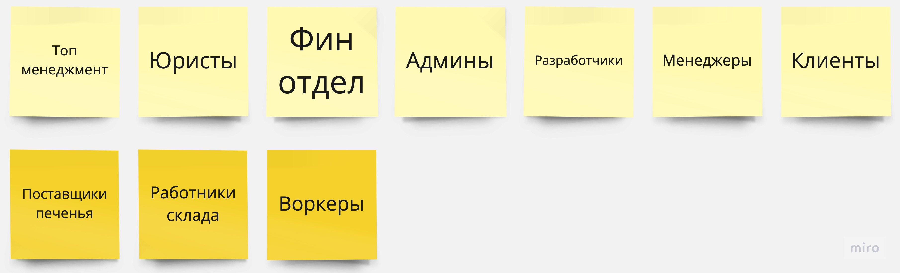
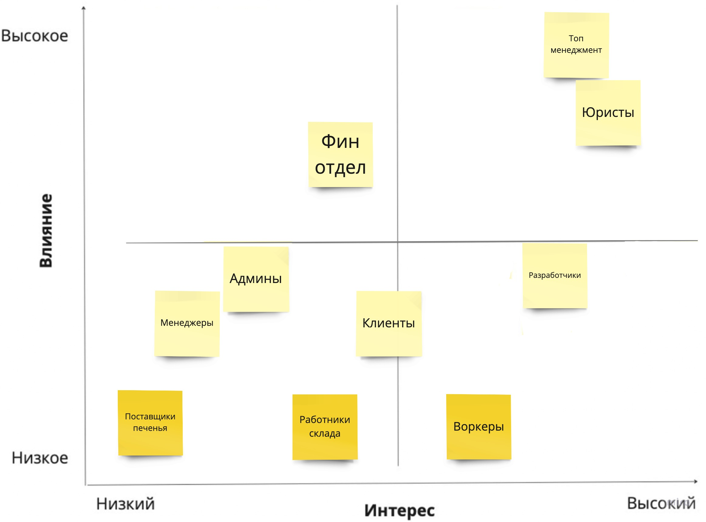
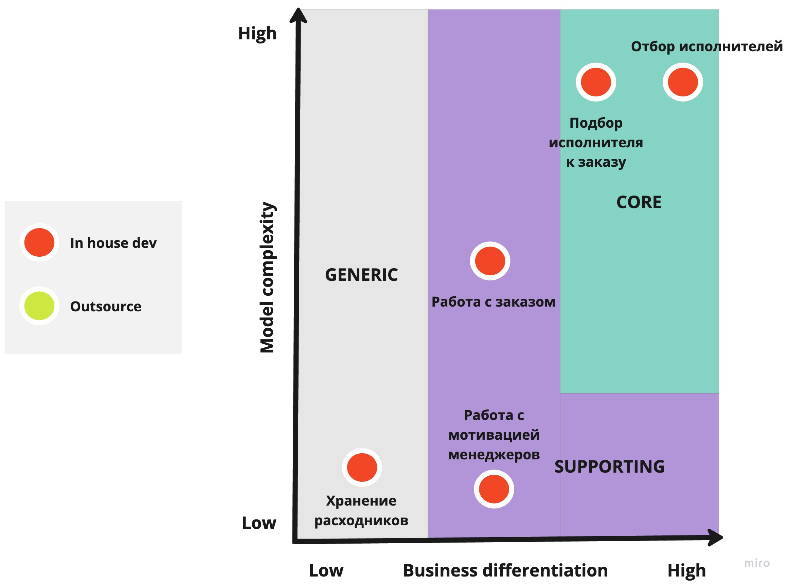
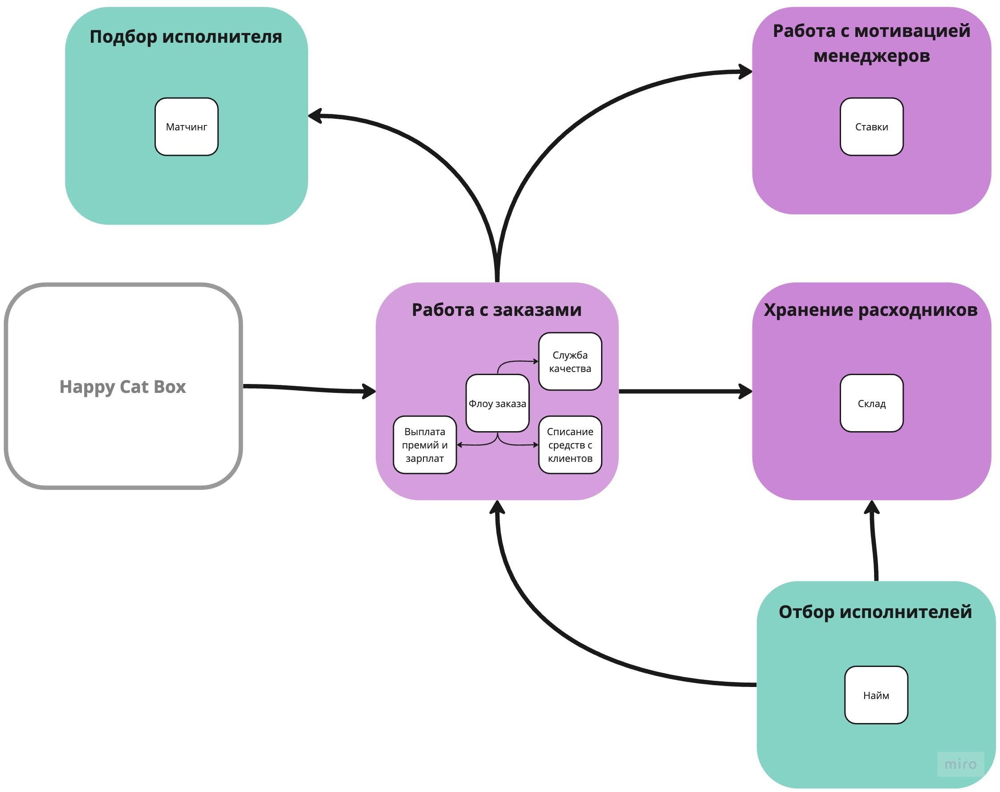
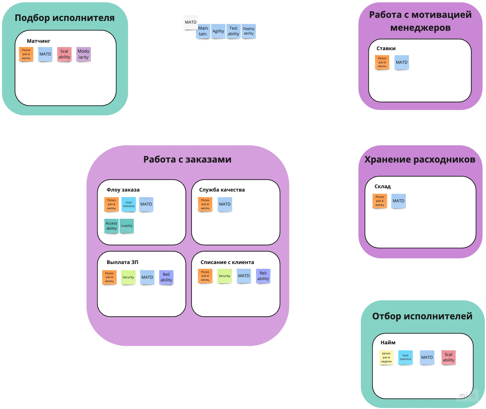
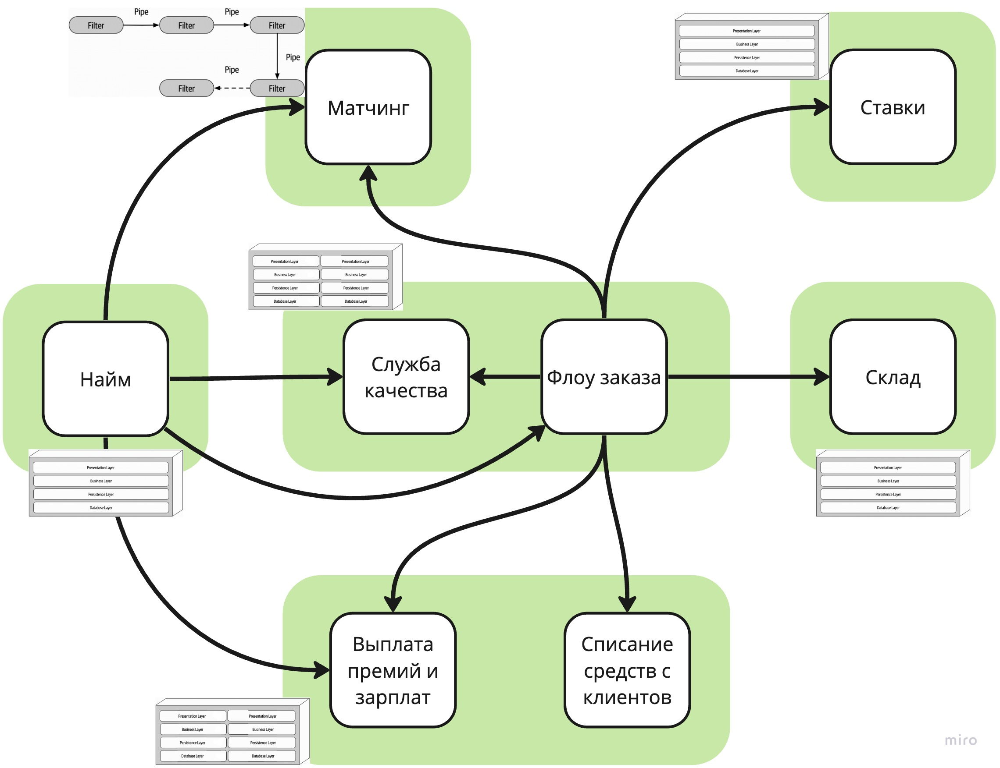
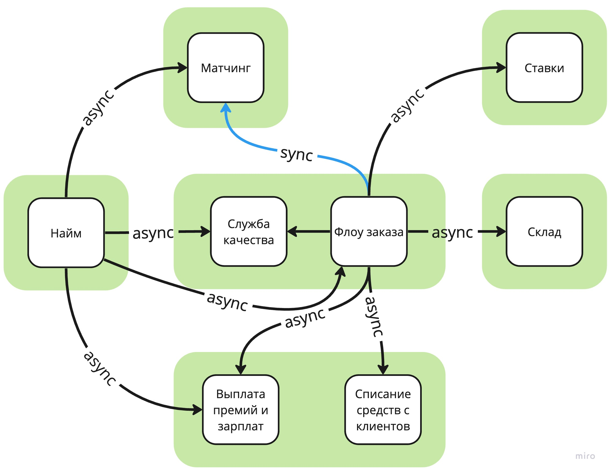

# Make cats free again (MCF)

## Stakeholders

Список получился из условия домашнего задания. Темнее выделены стейкхолдеры, которых не было в списке, но, которые, по моему мнению, должны присутствовать.

## Выбор архитектурного стиля

### Характеристики

**1 Availability/Fault tolerance**
> [US-081] Мы ожидаем 1 к заявок в день от рандомных котов, также, судя по отзывам, наши конкуренты могут попытаться нас заддосить в этом месте...

> (из ДЗ к 3 уроку) ...выяснилось, что котам из Happy Cat Box наш проект понравился, поэтому приходит не 10 заказов в день, а 10 заказов в минуту

**2 Security**

Для защиты данных исполнителей, клиентов и платежей.
Простая система ролей (Работник склада, Менеджер, Исполнитель, Клиент). Функциональность не пересекается.

> CatFinComplience

**3 Затраты неважны**
> ... Деньги на данный момент не критичны, happy cat box готовы потратить столько, сколько потребуется...

**4 Проект реализуется с 0**
> ... Для этого она планирует реализовать проект с нуля по заданным требованиям...

**5 Maintainability**

> (из урока 2) ...поддерживаемость суперважна, потому что без неё система скатится либо в big ball of mud...

Присутствуют поддомены с большой изменчивостью. К тому же проект только зарождается, без сомнений, он будет еще много раз дописан или даже переписан.

> (из ДЗ к 3 уроку) ...система должна работать без сбоев, а если сбой случается, то должно быть понятно, что и где чинить

**6 Agility 7 Testability 8 Deployability**

Из урока 2, как следствие присутствия требования низкого TTM.
> Бизнесу необходим высокий низкий ТТМ (Time To Market), чтобы конкурировать на рынке...

**9 Scalability**

Из урока 2, как следствие присутствия словосочетания "Конкурентное преимущество".
> Благодаря отсеву и матчингу компания планирует выделяться на фоне конкурентов...

**10 Modularity** 

Для Матчера, из требований.
> ...Наша цель — использовать реализованные шаги в нужной нам последовательности, которая иногда может изменяться, при этом необходимо иметь возможность добавлять или редактировать шаги, как нам это необходимо.

**11 Usability, 12 Accessability**

Для части Работы с заказом, потому что вовлечены клиенты (с остальными работают лояльные сотрудники компании), для них все должно быть понятно и удобно.

**13 Релизный цикл для всей системы — месяц, для Найма работников — неделя**

**14 Reliability

> (из ДЗ к 3 уроку) Фин отдел боится потерять любую финансовую информацию и хочет решение, которое будет гарантировать, что всё будет ок

### Выбираем стиль

В системе разные требования к разным частям (разные релизные циклы, например), и, так как **микросервисы** позволяют развивать отдельные части системы, он подходит больше остальных.

### Выбираем стиль коммуникаций

### Выбираем БД

### Фитнес функции

## ADR

